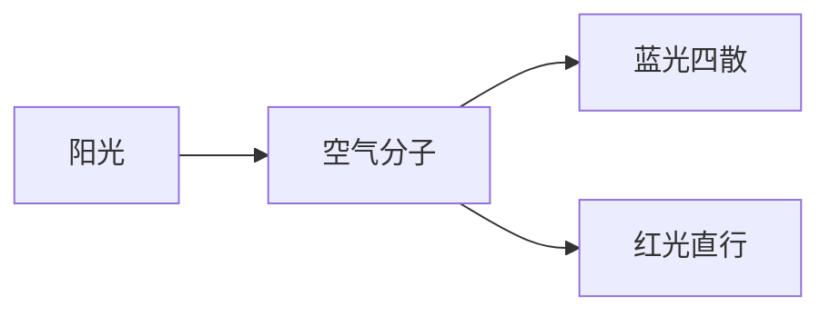

layout: section
---

# 功能一览
### 每一页演示一种版式

> say: 这一份用来演示各种版式。

---
layout: big-number
---

# 6 倍

蓝光的散射强度约是红光的六倍 {at: 蓝光}

> say: 一个大数字：蓝光的散射强度约是红光的六倍。

---
layout: compare
---

# 对比

### 白天 {at: 白天}
- 太阳高，光路短 {at: 光路短}

::right::

### 傍晚 {at: 傍晚}
- 太阳低，光路长 {at: 光路长, mark: highlight}

> say: 白天太阳高，光路短；傍晚太阳低，光路长。

---
layout: diagram
---

# 流程



> say: 阳光碰到空气分子，蓝光四散，红光直行。

---
layout: code
---

# 代码 {id: t}

```js {id: code}
function scatter(lambda) {
  return 1 / lambda ** 4;
}
```

> say: 用代码写出来，就是一个函数。

---
layout: code
transition: morph
---

# 代码 {id: t}

```js {id: code}
function scatter(lambda, ref = 700) {
  const k = ref / lambda;
  return k ** 4;
}
```

> say: 再改成以红光为参照的版本。

---
layout: timeline
---

# 时间线

1. 1871 瑞利提出散射理论 {at: 瑞利}
2. 1899 计算出天空亮度 {at: 亮度}
3. 1908 米氏散射补全大颗粒 {at: 米氏}

> say: 一八七一年，瑞利提出理论；一八九九年，算出天空亮度；一九零八年，米氏散射补全了大颗粒。

---
layout: quote
---

天空的蓝色，是空气分子给阳光“挑”出来的。 {spot: true}

> say: 一句话：天空的蓝色，是空气分子挑出来的。
